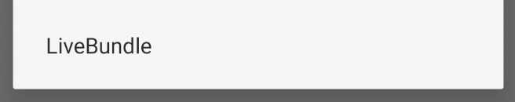
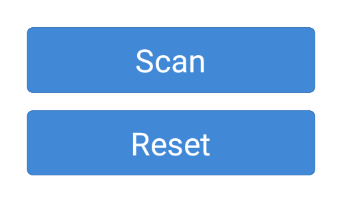

<h1 align="center">
    <br>
	
	<br>
</h1>

**This project is still in incubation.
If you are cloning this repository at this stage, be ready for a wild ride with potential consequent repository updates and breaking changes from one day to the next. _Or to put it another way : 'Not ready for production'._**

## Getting started

If you aren't yet familiar with LiveBundle, you can try out the [LiveBundle demo application](./example). Otherwise, if you're already familiar with LiveBundle or don't want to bother with the demo, you can jump straight ahead.

## Adding LiveBundle to your React Native application

Using npm

`$ npm install react-native-livebundle --save-dev`

Using yarn

`$ yarn add react-native-livebundle --dev`

LiveBundle has a peer dependency on [react-native-camera](https://github.com/react-native-community/react-native-camera). It relies on this native module for the QR Code scanning functionality. Therefore, you will also need to have a dependency on this package, if your application isn't already using it.

## Initializing LiveBundle

Just import `react-native-livebundle` in your top level component *(first screen launched)* and in `componentDidMount`, make a call to LiveBundle `initialize` method, with your Azure Blob Container url.

```javascript
import livebundle from 'react-native-livebundle';

componentDidMount() {
  livebundle.initialize({
    // Full Azure Blob Sotrage url including container
    // ex: 'https://foo.blob.core.windows.net/bar/'
    azureUrl,
  });
  // Other code ...
}
```

*BLE Remark: We should also offer alternative ways to initialize in the near future, such as by exposing a wrapper component to just wrap the top level application component*

## Using LiveBundle

Out of the box, LiveBundle adds a new menu item to the React Native developer menu.\
If your build offers access to this menu, you can just bring it up and tap `Livebundle`



This will bring up the LiveBundle menu, with the two following options:



Tapping `Scan` will bring up the QR Code scanner. If this is the first time you launch the scanner and have not yet granted camera access permission, LiveBundle will ask you for this permission. You can then just scan a LiveBundle package QR Code and it will download and install the bundle contained within *(if the package contains multiple bundle flavor, LiveBundle will ask you to choose which bundle flavor to install)*

Tapping `Reset` will reset the state of the application to what it was prior to installing any LiveBundle package *(for example in case a local metro server was used, it will reload the bundle from this local packager)*

If you are using a LiveBundle package Deep Link rather than a QR Code, then you can just navigate to the Deep Link.

## Programmatically launching LiveBundle

In case you are using builds that don't give access to the React Native developper menu, it is possible to launch LiveBundle menu programmatically, only by making the following call from your React Native application `livebundle.launchUI()`

Each application is different, so we cannot tell you precisely where from to make this call, but it will probably end up being done from your own application developer/debug menu.

*BLE Remark: Because we support deep link, we could also expose a deep link to launch LiveBundle UI as an alternative to this. For example livebundle://menu. This would make LiveBundle available even in builds that don't expose the RN dev menu, without having to do any additional  coding. Also should add instructions to launch LiveBundle menu programatically from the native side. Fringe case, but it can be done and could be useful to some.*

## Uploading LiveBundle packages

To generate and upload LiveBundle packages, you will need to add the [LiveBundle CLI](https://github.com/electrode-io/livebundle) to your application project. Please refer to the [README](https://github.com/electrode-io/livebundle/blob/master/README.md) of this project for instructions about setup and configuration.

*LiveBundle native module project was kickstarted using [create-react-native-module](https://github.com/brodybits/create-react-native-module) tool*
